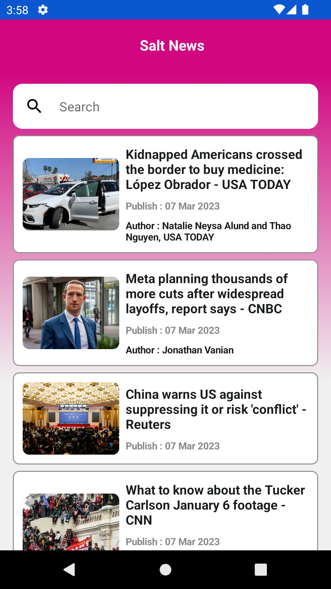

# Preview Slat News Apps Sample

| Screen Name | Display   |
| :---:   | :---: |
| Home |    |
| Detail |    |

## Min SDK Version

Support Android OS versions starting from Android 5.0 (Lollipop, API Level 21). Does not support prior Android versions.
Check [Dashboard](http://developer.android.com/intl/ru/about/dashboards/index.html) page for information about platform versions,
screen sizes and densities statistics.

## Tech Stack
### Architecture Framework : MVVM, Clean Architecture
### Depedency Injection  : Koin
### Network Componet  : Retrofit, OKhttp
### Image Newtwork : Glide

